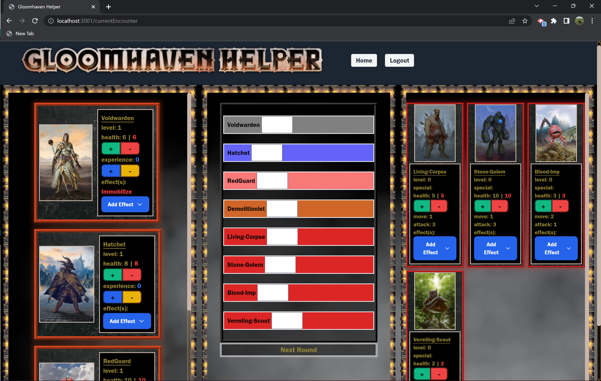

# Gloomhaven Helper
An application to reduce Gloomhaven board clutter.

## Description
A single Gloomhaven Campaign will span multiple [real world] days and includes many cards, tokens, and pieces.  Players often complain of having limited space for multi-day set up, or curious cats rearranging monster stats, and sticky-fingered kiddos stealing character tokens.  There is a whole variety of other worldly factors that can make keeping a Campaign organized a serious challenge.

Gloomhaven Helper is here to take many of those cards, tokens, and pieces off the table and into an easy to use application. Once they have created an account, user's will be able to create new campaigns or return to existing campaigns and create new encounters in real time.  This is an application to be used during game play but will signifcanly help in storing information inbetween play time so your game table - exposed to all the real worl elements - does not have to.

The team of developer's strengthened their collabortive skills by coming together on this full-stack project.  They learned how to use MySQL and Sequelize ORM for the databas.  They gained more experience with retrieving, adding, and deleting data through GET, POST and DELETE routes.  They also learned how to follow Handlebars templating.

## Table of Contents

- [Installation](#installation)
- [Technology](#technology)
- [Usage](#usage)
- [Screenshot](#screenshot)
- [Credits](#credits)
- [License](#license)
- [Contributing](#contributing)
- [Questions](#questions)

## Installation
Git clone the repository.  Once cloned, run `npm i` for package installation.  Then sign into Mysql and run `SOURCE db/schema.sql;`. Next, to seed the table `npm run seed`.  Finally, `node server.js` to view on the local host.

## Technology 

This application is backed by a MySql database with a Sequelize ORM.  The front end utilizes Handlebars for templating the HTML and TailwindCSS as the CSS framework.  Dotenv was used to load the project's required environment variables. BCrypt was used to hash user's passwords.  Sessions enables server-side storage allowing users to log back in and retrieve their stored campaign information.
      
## Usage
Users access the website at: https://gloomhaven-helper-deluxe.herokuapp.com 

To begin, users must create an account and login using their newly created username and secure password.  Once logged in, user's will see their personal dashboard.  They can either create a New Campaign or select an existing Campaign to return to.  If creating a new Campaign, users will name the campaign and then move to the New Campaign page.  

Here, they must select which Characters will join their campaign by checking the corresponding checkbox and click "Begin Your Adventure".  Next, users will be asked to select which monsters (and how many) are in the New Encounter.  There is a corresponding checkbox and quantity input per monster.  They must first select "Add Monsters" to save and then click "Begin You Adventure" to move on to game play.  Note: Users have the opportunity to select monsters for every New Encounter within a Campaign. 

At the Current Encounter, users can update their character's and monster's stats throughout the encounter.  The middle bar is a sortable bar to keep track of character and monster turns in the round.

When finished, users simply log out.  They can login at anytime and return to saved campaign's or begin again.
      
## Screenshot:

## Credits
A big thank you to the instructor extrodinaire and coding wizard, Joe Rehfuss.  Shout out to our TAs: Lindsey Fitzgerald, Henry Weigand, and William Lucht.

Team of Developers:

Alex Thiel https://github.com/dthiel22 

Dian Gigrich https://github.com/DianGigrich 

Matthew Dacaney https://github.com/Mattdack

Rachel Lally https://github.com/rachlally

## License
This application is covered under MIT License. See repo for license.
      
## Contributing
To contribute, contact the Project Manager, Dian Gigrich at slayer_barrett_@hotmail.com.

      
## Questions

Contact Project Manager: slayer_barrett_@hotmail.com